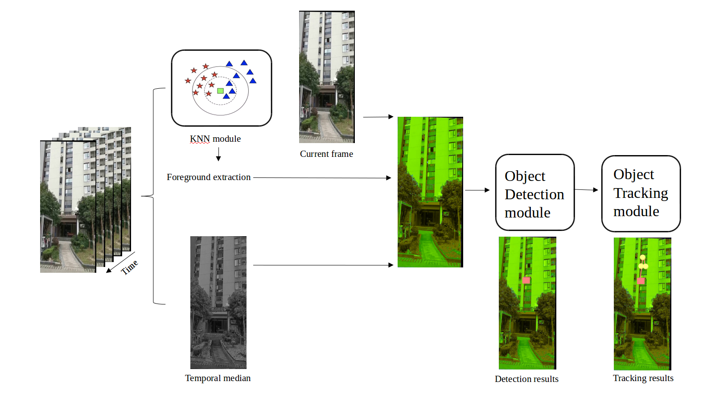

高空抛物检测
===========================

######α版本功能
1. 视频去抖
2. 前景提取
3. 抛物检测

###环境依赖
1. torch==1.1.0
2. torchvision==0.2.2.post3
3. opencv-python

###数据预处理
1. 视频转成图片

       python mp4topng.py //代码内部修改对应路径

2. 视频去抖
   
       python video_stable.py //根据特帧点匹配原理，进行图像配准

3. 前景提取

       python bgs_opencv.py //可选择KNN或MOG进行前景提取

4. 假彩色图像合成

       python fake_image_merge.py

###目标检测
- 数据及标注文件按照VOC2007格式存放 

1. 模型训练

       python train.py

2. demo示例
 
       python demo.py

###TO-DO List
  - [x] 视频去抖
  - [x] 抛物检测
  - [ ] 增加目标跟踪
  - [ ] 滤除非向下运动的目标
